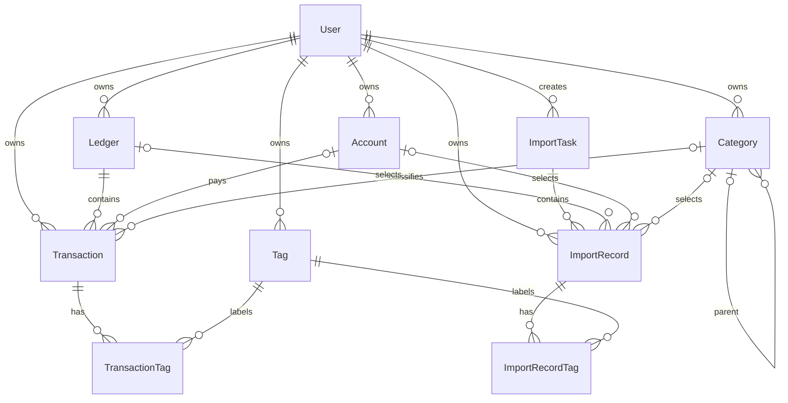

# Database

Personal Ledger 使用 PostgreSQL 与 Prisma ORM。当前数据库设计面向多用户个人账本，所有业务主表均通过 `userId` 隔离；涉及用户资源的外键同时校验资源所属用户，避免跨用户关联。

## 模型职责

### User

用户主体。第一版只使用 `UserRole` 枚举区分 `ADMIN` 与 `USER`，不创建独立 Role 表或复杂 RBAC。

### Ledger

账本是交易所属的统计空间，例如默认账本、特殊账本、公司账本。每笔正式交易必须属于一个账本。一个用户可以拥有多个账本，但同一用户下账本名称唯一。

默认账本的“每个用户只能有一个”规则暂由后续业务 Service 在事务中维护，因为 Prisma Schema 无法直接表达带条件的唯一约束。

### Account

账户是实际支付或收款账户，例如现金、微信钱包、银行卡、信用卡。同一用户下账户名称唯一。

### Category

分类是交易的单一主分类，区分收入和支出，并通过 `parentId` 支持父子层级。一笔交易最多关联一个分类。

### Tag

标签是用户自由定义的补充维度。同一用户下标签名称唯一。一笔交易可以关联多个标签，关系由 `TransactionTag` 保存。

### Transaction

正式交易记录：

- `amount` 使用 `Decimal(19, 4)`，不使用浮点数。
- `transactionTime` 表示真实交易时间。
- `description` 保存平台原始交易说明或商品说明。
- `remark` 保存用户自己的备注，二者不能合并。
- `source` 表示数据来源平台；`accountId` 表示实际支付账户。
- `fingerprint` 只用于疑似重复识别，只有普通索引，没有唯一约束。
- `sourceTransactionId` 有值时通过“用户 + 来源 + 平台交易号”唯一约束进行强判重。
- `rawData` 对手工账单可为空；对导入账单必须完整复制对应 `ImportRecord.rawData`。

### TransactionTag

正式交易与标签的显式多对多关系表，`transactionId + tagId` 为复合主键。关系同时携带 `userId`，复合外键保证交易与标签属于同一用户。

### ImportTask

一次文件导入任务，记录来源、文件名、状态和各类统计数量。导入文件不会直接写入 Transaction。

### ImportRecord

导入工作台中的临时记录。解析结果先进入 ImportRecord，用户可在预览阶段调整标准化字段，确认后才生成 Transaction。

`rawData` 为必填 JSONB 原始快照。修改商户、说明、备注、分类、账本、账户、标签、金额或时间时，不得修改或重建 `rawData`。后续实现编辑接口时，`rawData` 不应出现在预览编辑 DTO 中。

### ImportRecordTag

导入预览记录与标签的显式多对多关系，用于在确认导入前添加或移除标准化标签，不影响 `rawData`。

## 关键概念边界

- 分类 ≠ 标签 ≠ 账本：分类是单一主分类，标签是自由多选维度，账本是统计空间。
- 来源 ≠ 账户：淘宝是来源，支付宝可以是支付账户。
- description ≠ remark：前者是平台原始说明，后者是用户备注。
- rawData ≠ 标准化字段：rawData 保存导入文件原貌，预览编辑只修改标准化字段。
- Ledger 负责默认统计与特殊统计的空间划分；当前不增加 `isHidden`、`isExcluded` 或 `includeInStatistics`。

## 导入流程

```text
文件 -> 解析 -> ImportTask / ImportRecord -> 用户预览和编辑 -> 确认导入 -> Transaction
```

确认导入时需要在同一数据库事务中：

1. 读取 ImportRecord 的标准化字段。
2. 原样复制 `rawData` 到 Transaction。
3. 将 ImportRecordTag 转换为 TransactionTag。
4. 将 ImportRecord 标记为 `IMPORTED`。

本阶段只建立数据结构，尚未实现上述业务流程。

## 时间规范

所有 `createdAt`、`updatedAt` 与 `transactionTime` 均使用 PostgreSQL `TIMESTAMPTZ(3)`。PostgreSQL 保存的是绝对时间点，API 使用 JavaScript `Date` 与 Prisma 交互，并统一按 UTC ISO 8601 传输。部署数据库的默认时区和应用进程时区应配置为 UTC；客户端仅在展示层转换为用户所在时区。

## 删除策略

本阶段没有删除或恢复业务，因此不预先增加 `deletedAt`。待明确回收站和恢复规则后再通过独立迁移增加，避免所有查询过早承担软删除过滤条件。

## ER 关系



## 数据库命令

在 `apps/api` 中复制示例配置并填写真实连接信息。`DATABASE_URL` 供 NestJS 运行时使用，`DIRECT_URL` 供 Prisma CLI、migration 与 seed 使用：

```bash
cp .env.example .env
```

常用命令：

```bash
pnpm --filter @ledger/api prisma:validate
pnpm --filter @ledger/api prisma:generate
pnpm --filter @ledger/api prisma:migrate --name init
pnpm --filter @ledger/api prisma:seed
```

生产或已生成迁移的环境使用：

```bash
pnpm --filter @ledger/api prisma:migrate:deploy
```
